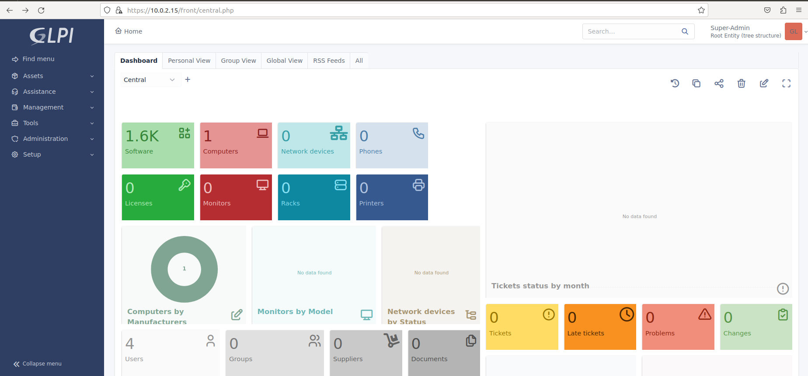
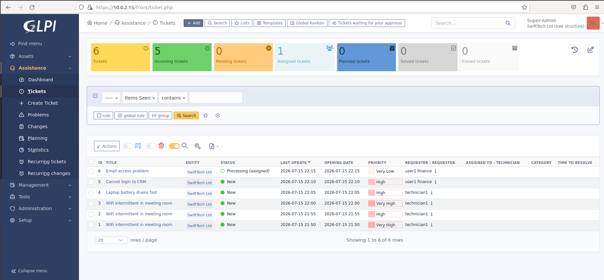

# SwiftTech Helpdesk – GLPI Automation & API Showcase

A complete, self‑contained ITSM project built around **GLPI** to demonstrate real‑world IT operations skills. The system simulates a growing SME (SwiftTech Ltd) with automated ticket routing, asset discovery, SLA‑based escalation, and a REST API integration layer – all deployed on a single low‑resource laptop using VirtualBox.

## Overview

## Technologies Used

- **ITSM Platform:** GLPI 10.0.x
- **Web Stack:** Debian 12, Nginx, PHP‑FPM 8.2, MariaDB
- **Asset Discovery:** Native GLPI Inventory Setup
- **Automation:** Python 3, Bash, cron, GLPI Business Rules, SLA engine
- **API:** GLPI REST API (ticket creation, update, asset retrieval)
- **Virtualisation:** VirtualBox (2 VMs, NAT Network)

## Key Features

- **Automated Workflows**
  - Tickets automatically routed to the correct team based on keywords.
  - Critical tickets escalate to management if unresolved within 2 hours.
  - Knowledge base articles generated upon ticket resolution.

- **API Integration & Scripting**
  - Python/Bash scripts create and query tickets, demonstrating external system integration.
  - Cron‑driven random ticket generator simulates a busy helpdesk.

- **Real Asset Management**
  - Client VM inventoried automatically, showing full hardware/software details in GLPI.

## Why This Project Matters

It demonstrates hands‑on ability to deploy an enterprise‑grade helpdesk, automate repetitive IT tasks, manage assets, and integrate systems via APIs – all essential skills for helpdesk lead, junior sysadmin, or IT asset management roles.

---

